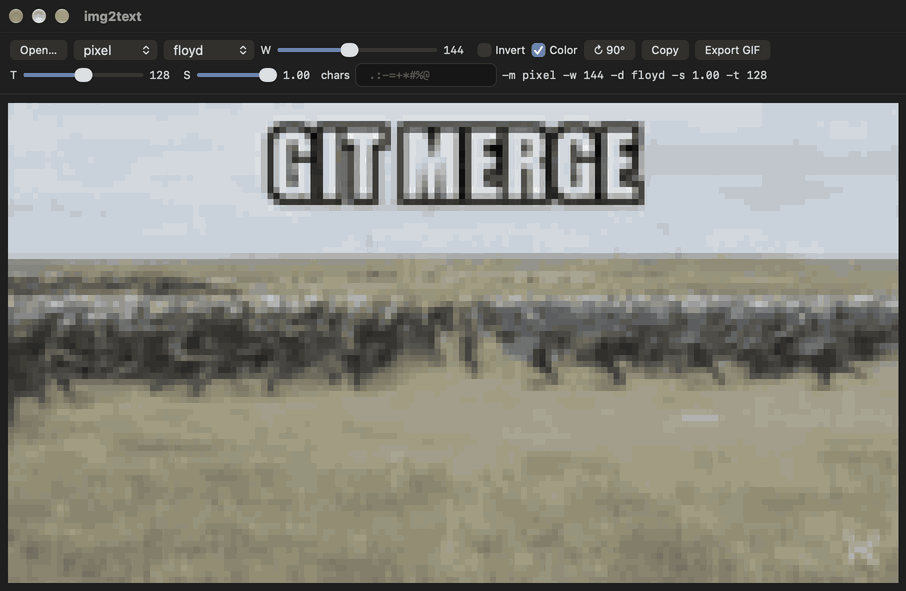

# img2text

[](https://swift.org)
[](https://github.com/Jam-Sw/img2text/releases/latest)

Turn images and GIFs into text.



## Install (get img2text command)

```sh
curl -fsSL https://raw.githubusercontent.com/Jam-Sw/img2text/main/install.sh | sh
```

#### Run GUI (macOS):
```sh
img2text --gui
```

Or download (unsigned) `img2text.app.zip` from [Releases](https://github.com/Jam-Sw/img2text/releases).

---

```sh
img2text                       # opens the app: drop an image or GIF, tune, Copy or Export
img2text photo.png             # prints to the terminal
img2text photo.png -m pixel    # true-colour square tiles, 2 per character
img2text anim.gif              # plays in the terminal, Ctrl-C to stop
img2text --help                # all modes and flags
```

Copy and Export follow the source: PNG for stills, animated GIF for GIFs.

Limits: width 1000, rows 1000, 256 MB frame cache; exports over 512 MB drop frames evenly (total duration kept).

## Build and release

```sh
swift build -c release         # needs Xcode command line tools
./release.sh 0.1.0             # dist/img2text + dist/img2text.app.zip (Apple Silicon + Intel)
gh release create v0.1.0 dist/img2text dist/img2text.app.zip --title v0.1.0 --generate-notes
```
